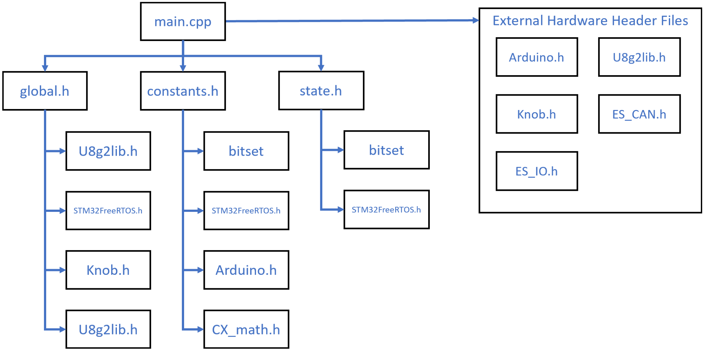

# Dependencies

### Compilation Dependencies 
Below shows a figure of how different .cpp and .h files depend on each other. All external hardware libraries are managed by PlatformIO, as well as custom header files written for this project. The project depends on cx_math.h,  with its source and license commented in /include/cx_math.h, to use the pow function to generate the step sizes constexpr. This maintains compatibility with all platforms and toolchains.

Here is a graph for all compilation dependancies.
# Deendancy Graph (libraries, not variables)

